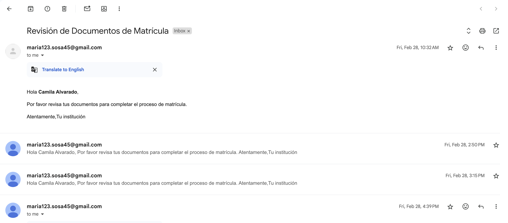

Espanol- Esta es una aplicacion que fue creada para la empresa Rombo, con el fin de enviar notificacines a los estudiantes correspondientes a pago, falta de documentos u otra. 
Se creo una API en Node.js y se hizo uso de la libreria node-cron para programar la hora y dia qque se debe enviar la notificion, y la libreria node-mailer para el envio por correo electronico.

English- This is an application created for the company Rombo to send notifications to students regarding payment, missing documents, or other issues.
An API was created with Node.js, using the node-cron library to schedule the time and day the notification should be sent, and the node-mailer library for email delivery.

